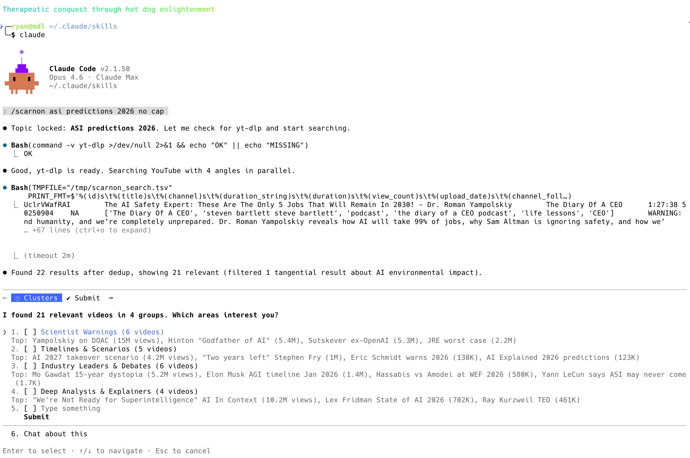

# scarnon

**"Scarnon?"** — Australian for *"what's going on?"*

A [Claude Code](https://docs.anthropic.com/en/docs/claude-code) skill that rips through YouTube so you don't have to. Chuck it a topic, it'll find the videos, grab the transcripts, and give you the good oil — all without leaving your terminal.



## What's it do

You say `/scarnon nuclear fusion breakthroughs` and it:

1. **Searches YouTube** from multiple angles (4 parallel queries, ~30 seconds flat)
2. **Filters out the rubbish** — no one asked for Shroud of Turin when they searched for fusion
3. **Clusters the results** into sensible groups (explainers, debates, interviews, etc.)
4. **Lets you pick** which clusters and videos you actually care about
5. **Downloads subtitles** in parallel (auto-captions, no Whisper needed for ~80% of videos)
6. **Fans out to Haiku subagents** — each one reads a transcript and sends back a tight summary, keeping the main context lean as
7. **Synthesises across videos** with lenses you choose: shared themes, contradictions, fact checks, open questions, whatever
8. **Gives you timestamped quotes** so you can jump straight to the good bits

The whole thing runs in about 2 minutes for 3 videos. Not bad for a bloke in a terminal.

## Installation

Chuck it in your skills directory:

```bash
git clone <this-repo> ~/.claude/skills/scarnon
```

Or just paste this repo URL into Claude Code and say *"oi install this skill for me yeah"* — it'll figure it out. She's not stupid.

That's it. She'll show up as `/scarnon` next time you fire up Claude Code.

### Dependencies

Scarnon installs tools **as it needs them**, not all up front. First time you run a search it'll check for `yt-dlp` and offer to install it. You won't get asked about `ffmpeg` or `mlx_whisper` until you actually need them (which for auto-captions, you don't).

The only hard requirement for search + subtitle mode:

```bash
brew install yt-dlp
```

## Usage

```
/scarnon                              # guided — asks you what topic
/scarnon future of jobs AI            # pre-filled topic, straight to search
/scarnon https://youtube.com/watch?v=dQw4w9WgXcQ   # just transcribe this one mate
```

The URL mode is for when you've already got a video and just want the summary. No search, no clustering, no fuss. The topic mode is for when you want to go fishing across YouTube and see what's out there.

## How it works under the hood

### Search (the fast bit)

Four `yt-dlp` searches run in parallel with `&` and `wait`. Each grabs 10 results with rich metadata (views, subs, date, tags, description) in a single `--print` pass. No `--dump-json` — that returns 700KB per video and is slow as. The whole search takes ~30 seconds wall time.

### Subtitles (the free bit)

~80% of YouTube videos have auto-generated captions. Scarnon grabs those via `--write-auto-subs` — takes about 4 seconds per video, no audio download, no Whisper, no GPU. Parallel download for the lot.

### Extraction (the clever bit)

SRT files are 30-70KB each. Reading three of them into your context window is a bad time. Instead, scarnon fans out to parallel Haiku subagents — each reads one transcript, extracts themes/quotes/claims into ~2KB of structured markdown, and sends it back. The main context never sees the raw subtitles. Fan-out, fan-in. Sweet as.

### Synthesis (the useful bit)

With compact extractions from each video, the main model cross-references them through whichever lenses you picked: shared themes, contradictions, unique insights, open questions, fact checks, timelines, action items. All with timestamped YouTube links so you can verify anything that sounds suss.

## A case for better AI harness tools

Scarnon is partly a proof of concept. It demonstrates what you can build when an AI harness gives you even basic UI primitives and orchestration tools.

Right now, Claude Code gives skills two key tools beyond the usual read/write/bash:

- **`AskUserQuestion`** — structured prompts with options, multi-select, descriptions. Scarnon uses this four times: topic input, cluster selection, smart narrowing, and lens selection. Each one takes messy data and turns it into a clean decision point. Without it, every interaction would be "type something and hope I parse it right."

- **`Task` subagents** — spin up parallel child agents with their own context. Scarnon fans out to Haiku subagents for transcript extraction: each reads a 30-70KB SRT file independently and returns ~2KB of structured summary. The main context never sees the raw transcripts. Without this, three videos would blow the context window.

That's only two tools and look what falls out: a guided research workflow with parallel search, progressive refinement, context-efficient extraction, and multi-video synthesis. All from a markdown file.

Now imagine what skills could do with:
- **Persistent state** — remember user preferences, research history, cached results across sessions
- **Rich selection UI** — checkboxes on actual video cards instead of text descriptions
- **Progress indicators** — real progress bars instead of "3/5 videos done..."
- **File/artifact output** — render the synthesis as a proper document, not just chat messages
- **Webhooks/triggers** — run a search on a schedule, alert when new content drops on a topic

Every UI primitive you add to the harness is a building block for skill authors. The more tools we get, the less janky the UX, and the more ambitious the skills people will build. Scarnon's a taste of what's possible with sweet FA to work with. Give us more and we'll build you something proper.

## What it doesn't do (yet)

- **Whisper fallback** — for the ~20% of videos without auto-captions
- **Library mode** — browse your cached transcripts
- **Compare mode** — side-by-side analysis of cached videos
- **Non-YouTube** — podcasts, MP3s, etc.

She'll get there. Baby steps.

## Something broken?

Don't stress. The skill is just a markdown file — `SKILL.md` — and Claude can read and edit it. If something's not working right, just tell Claude:

> *"oi the search is coming back with garbage, fix the skill"*

It'll read the SKILL.md, figure out what's wrong, patch it, and the fix takes effect immediately — no restart needed. Skills hot-reload every time you invoke them.

If you reckon your fix is useful for everyone, open a PR. Or don't. No worries either way.

## Why "scarnon"?

Because every good tool deserves a name that makes people go "what?" before they try it. Also because `/transcribe` was taken and this one's better anyway.

If you're not Australian: "scarnon" is short for "what's going on" — as in, *"scarnon with nuclear fusion?"* or *"scarnon in the Middle East?"*. It's what you say when you want the lowdown. Which is exactly what this does.

## Licence

Do what you want with it mate. Just don't be a drongo about it.

---

## Appendix: History of Australia told with emojis

Because every README needs completely irrelevant bonus content.

**1900s** 🐑🐑🐑🏴󠁧󠁢󠁥󠁮󠁧󠁿➡️🇦🇺🎉 Federation! Six colonies put on a trenchcoat and pretended to be a country.

**1910s** 🇦🇺⚔️🇹🇷💀 Gallipoli. Went to the wrong beach. Became a national identity anyway.

**1920s** 🐨🌾🍺📈 She'll be right. Soldiers came home, wool prices went up, everyone had a beer.

**1930s** 📉😰🌾💀🐇 Depression hit. Then the rabbits came. Then the dust. Rough decade.

**1940s** 🇦🇺⚔️🇯🇵💣🏥✌️ Another war. Darwin got bombed. Kokoda happened. We don't talk about it enough.

**1950s** 🏗️👷🇮🇹🇬🇷🏠🏟️ Post-war boom. Built Snowy Hydro. Invited half of Europe over. Melbourne Olympics.

**1960s** 🏄🎸🇻🇳✊😡 Surfing took off. Got dragged into Vietnam. People got angry about it. Fair enough.

**1970s** 🧔🎵🍷👔🔥💔 Whitlam got sacked. Pub rock peaked. Wine replaced beer (briefly). Political chaos.

**1980s** 🍺🏏⛵🐊🎬🤠 Bob Hawke skolled a yard glass. Won the America's Cup. Crocodile Dundee. Peak Australia.

**1990s** 🦘💻🏉🎶🌏 Dial-up internet arrived. Keating looked to Asia. Silverchair. Everyone got a mobile phone the size of a brick.

**2000s** 🏅🔥🌊💧😢🏠💰 Sydney Olympics. Then bushfires. Then floods. Then drought. Then the mining boom paid for everyone's mortgage.

**2010s** 🔄👔🔄👔🔄👔🏠📈🔥 Six prime ministers in a decade. House prices went mental. The fires got worse.

**2020s** 🦠🔒🏠💻🤖🔥🌊 COVID locked everyone inside. Worked from home. AI showed up. Climate kept being cooked. She'll be right. Probably.

### The next 50 years (predictions, no refunds)

**2030s** 🤖🏠💸🌞⚡🚄🦈 AI takes half the desk jobs. Nobody notices because they were on Slack anyway. Solar panels on every roof. High-speed rail from Sydney to Melbourne gets announced for the 47th time. Shark drones patrol Bondi. A house in Sydney still costs more than God.

**2040s** 🧬🌿🏜️💧🐊🤝🦘 Gene-edited crops handle the drought. The Top End becomes the food bowl. Crocodile diplomacy opens trade with Indonesia. Kangaroos are formally granted voting rights in a non-binding plebiscite that goes nowhere. Desalination plants everywhere. Perth finally gets interesting.

**2050s** 🚀🇦🇺🌕🏗️⛏️🍺 Australia's mining companies pivot to asteroid mining because of course they do. First Aussie on the Moon plants a flag and immediately asks where the nearest pub is. Space mining boom makes the 2000s look quaint. Lunar colony gets a Bunnings before a hospital.

**2060s** 🌊🏝️🏙️🐠🤖👴 Sea levels reclaim parts of the Gold Coast. Nobody's that upset because the apartments were ugly anyway. Floating suburbs become a thing. Reef restoration finally works after 40 years of "we're working on it." AI runs most of the government. Honestly, improvement.

**2070s** 🧊🌏🤝🦅🏄🎭 Climate starts stabilising. Australia hosts the Global Climate Summit in a fully solar-powered stadium in Alice Springs. The emu is declared the national spirit animal after winning a second war (don't ask). Surfing becomes an AI-judged Olympic sport. Nobody agrees with the scores. Some things never change.

**2080s** 🧠💡🌐🏠🦑🍷 Neural interfaces go mainstream but Australians mostly use them to send each other memes faster. Housing finally becomes affordable after people realise you can live literally anywhere with satellite internet. Giant squid discovered off Tasmania. Barossa Valley wine now costs $4,000 a bottle and is worth every cent.

**2090s** 🌍🤖🧬🎉🇦🇺🍻 Australia accidentally becomes a superpower because everyone else had wars and we were too far away to get involved. Population hits 60 million, half of whom are in Melbourne arguing about coffee. Genetic engineering means nobody ages past 50 but everyone still complains about their knees. The national motto is officially changed to "she'll be right" and nobody argues.

**2100** 🦘🤖🌏🍺🏄✨ Heat death of the universe still 10^100 years away. Sydney-Melbourne rail still under consultation. A kangaroo with cybernetic legs wins gold at the Olympics. The last coal mine is converted into a craft brewery. Australia is exactly the same as it's always been, just with better wifi. She'll be right.

---

Also check out [peon-ping](https://peon-ping.vercel.app) — Warcraft peon sound notifications for Claude Code. Because you deserve to hear "work work" every time a tool fires. It's great.
